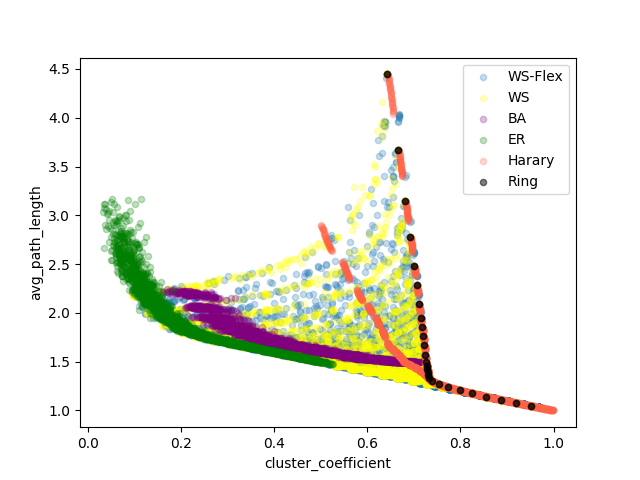

# Graph-Structure-of-Neural-Networks
An unofficial re-implementation of Graph Structure of Neural Networks (Jiaxuan You · Kaiming He · Jure Leskovec · Saining Xie) ICML 2020
https://arxiv.org/abs/2007.06559

# TODO
- [ ] Graph
    - [x] Graph generator
      - [x] WS-flex
      - [x] sample
      - [x] analyse **clustering coeffient** and **average length** of graphs generated by this generator
    - [x] Sample Graphs
    - [ ] Graph to Neural Network Converter
- [ ] Evaluate
  - [ ] Train/Eval on cifar10
  - [ ] Train/Eval on ImageNet
- [ ] Analyze

## Graph
1. Generat Graphs
```bash
python -m nx_ops.create create_all
```
2. Analyse Clustering coeffient and average length.

Use pandas and draw graphs like:
```python
df_ws.dropna().sample(4000).plot.scatter("cluster_coefficient", "avg_path_length",alpha=0.25, color="yellow", ax=ax, label="WS")
```
etc, get

